# End-to-End DevOps Project: Self-Hosted GitOps Infrastructure

**1. Резюме проєкту**

**One-liner:** Комплексна **ArgoCD (GitOps)** платформа в кластері **Kubernetes**, побудована на базі **Ansible**, автоматизованого пайплайну **Jenkins** та моніторингу **VictoriaMetrics**.

**Мета:** Реалізувати повний життєвий цикл доставки ПЗ у локальному середовищі, використовуючи **Ansible** для підготовки інфраструктури, **Jenkins** для збірки та перевірки коду, **Kubernetes** для запуску сервісів, **ArgoCD** для автоматизації деплою та **VictoriaMetrics** для глибокої видимості стану системи.

**2. Технологічний стек**

| Сфера | Інструменти |
| --- | --- |
| Infrastructure (IaC) | Vagrant, Ansible |
| Orchestration | Kubernetes (Minikube) |
| Containerization | Docker |
| CI/CD / GitOps | Jenkins, ArgoCD, Helm |
| Observability | VictoriaMetrics, VictoriaLogs, Grafana |
| Security/Quality | SonarQube |
| Networking | HAProxy, Ingress Controller |
| Database | PostgreSQL (with PVC) |

**3. Опис реалізації**

Інфраструктура розгортається у VirtualBox.

Infrastructure & Networking

 - Vagrant cтворює три віртуальні машини у приватній мережі і надає їм IP адреси (Jenkins, Ansible, Slave).

 - Ansible автоматизує конфігурацію: встановлення Docker, Minikube тощо.

 - Налаштовано дворівневу схему балансування. Зовнішній трафік приймається HAProxy на рівні віртуальних машин і перенаправляється на Ingress Controller всередині Kubernetes кластера. Це дозволяє гнучко керувати маршрутизацією та забезпечувати доступ до сервісів за доменними іменами (app.local, grafana.local, тощо).

CI Pipeline (Jenkins & SonarQube)

 - Пайплайн реалізований через Jenkins із використанням SCM Polling для реагування на зміни в коді, без ручного втручання.

 - Кожен білд проходить аналіз у SonarQube.

 - Налаштовано Quality Gates: якщо код не відповідає стандартам безпеки або якості, пайплайн зупиняється, блокуючи пуш Docker-образу. Це гарантує стабільність релізів.

Delivery & GitOps (ArgoCD & Helm)

 - Деплой реалізовано за концепцією GitOps.

 - ArgoCD відстежує стан Helm-чартів у Git-репозиторії.

 - У разі відхилення конфігурації в кластері від описаної в Git, ArgoCD автоматично виконує Self-healing.

 - Використання Helm дозволяє параметризувати деплой та легко керувати версіями застосунку.

Monitoring & Efficiency (VictoriaMetrics)

 - Замість класичного Prometheus-стека обрано VictoriaMetrics, що є критично важливим для локального середовища з обмеженими ресурсами.

 - vmagent збирає метрики з Kubernetes та віртуальних машин.

 - VictoriaLogs інтегровано для централізованого збору логів.

 - Дані візуалізуються у Grafana. Такий вибір дозволив знизити споживання RAM в порівнянні зі стандартними рішеннями.

**4. Скріншоти**

 - ArgoCD: Стан застосунків у кластері

 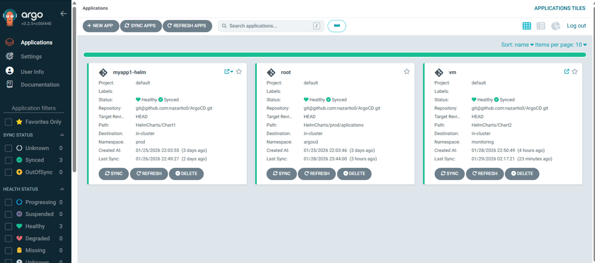

 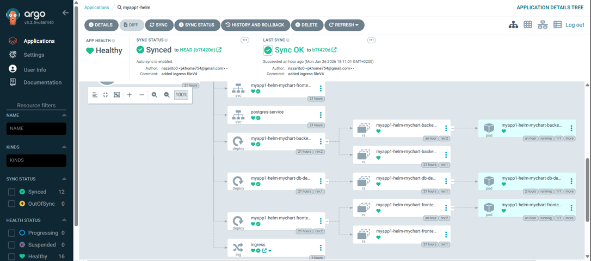

 - Grafana: Моніторинг ресурсів та метрик

 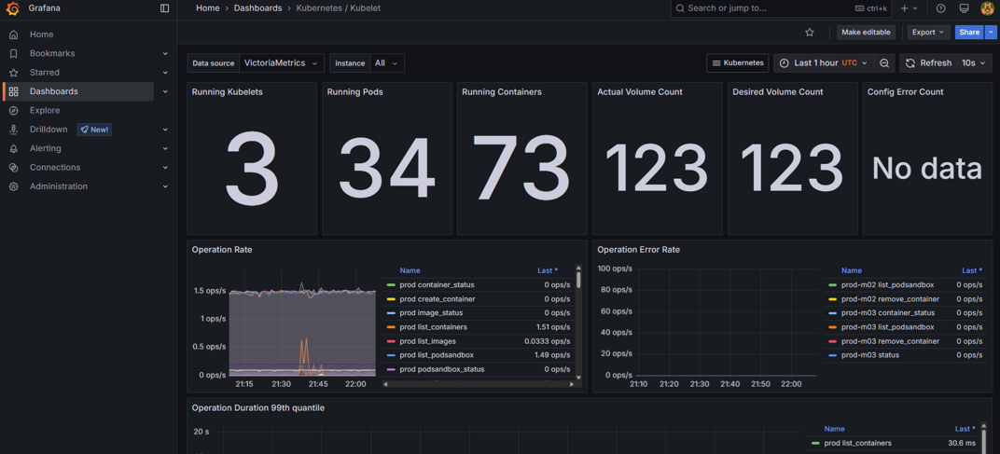

 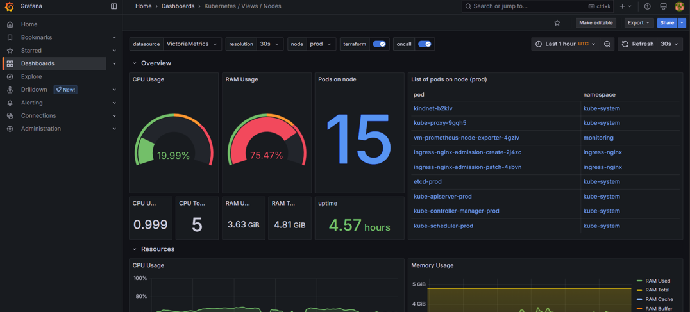

 - SonarQube: Звіт про якість коду

 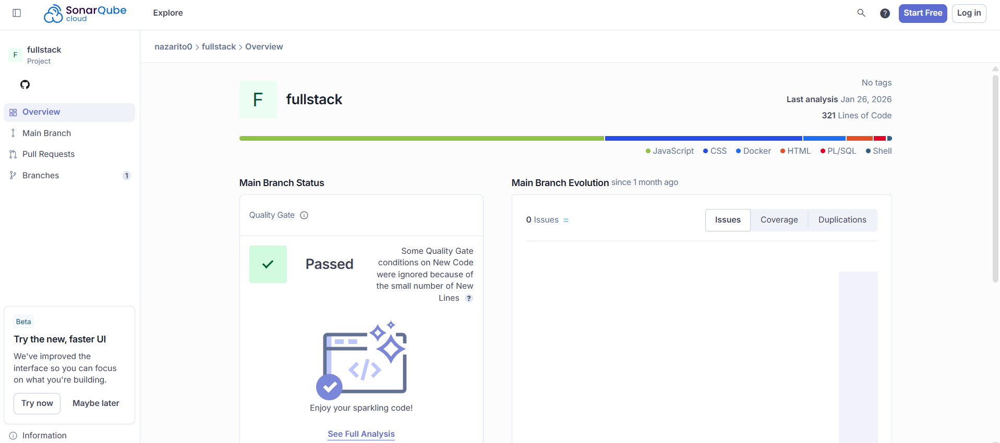

**5. Як запустити**
 - Встановіть VirtualBox:

 `https://www.virtualbox.org/wiki/Downloads`

 - Клонуйте репозиторій.

 `git clone (repo url)`

 - Підніміть віртуальні машини, запустивши Vagrantfile у папці vagrantfile:

 `vagrant up`

 - Запустіть скрипт на ansible ноді:

 `script.sh`

 - Запустіть скрипт на jenkins, slave нодах:

 `script2.sh`

 - Запустіть усі конфігураційні файли з розширенням .yaml в папці (ansible) через Ansible (з ноди ansible):

 `ansible-playbook -i hosts docker.yaml`

 - Додайте мапінг IP-адрес у файл hosts вашої Windows-системи для доступу до сервісів (jenkins.local, grafana.local, тощо).

 `C:\Windows\System32\drivers\etc\hosts`

 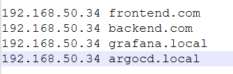

 ---

 - **Налаштування jenkins vm**

 - Витягніть пароль для jenkins:

 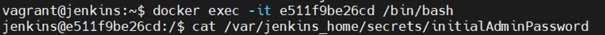

 - Встановіть плагіни:

 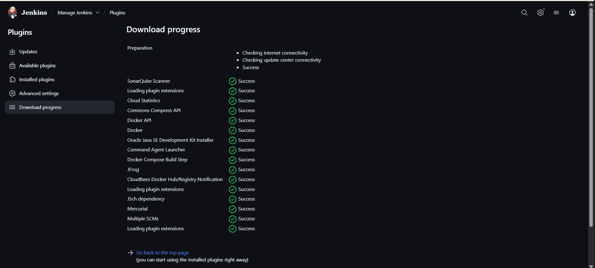

 - Добавте у Jenkins credential щоб підключитися до slave, через SSH, приватнй ключ розташований у папці де Vagrantfile:

 `D:\...\.vagrant\machines\slave\virtualbox`

 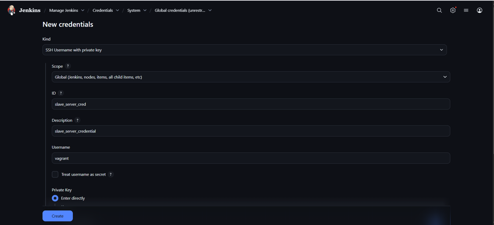

 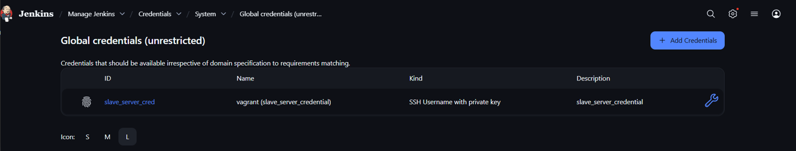

 - Виконайте наступні дії щоб налаштувати усе необхідне для коректної роботи Jenkins:

 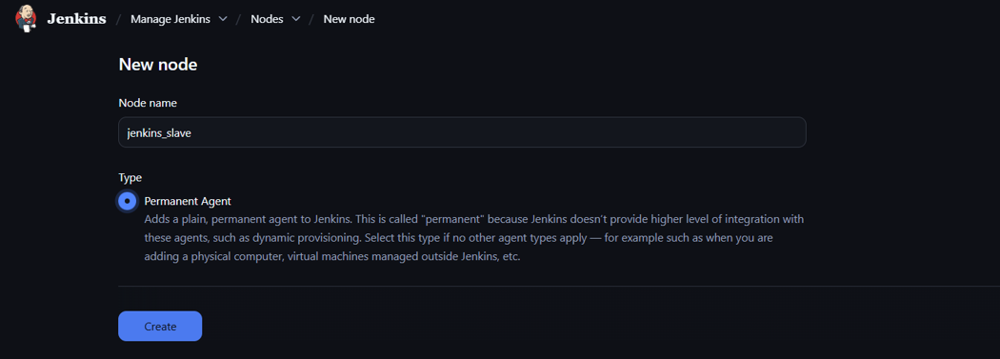

 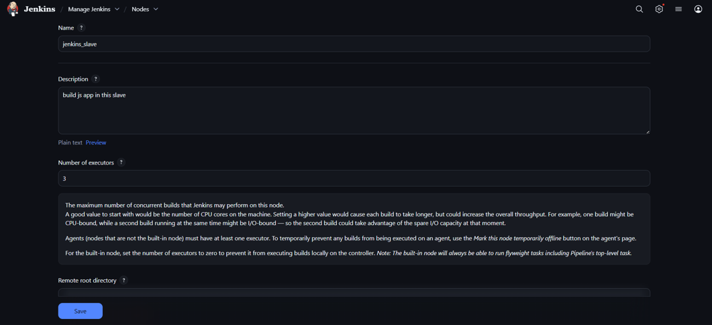

 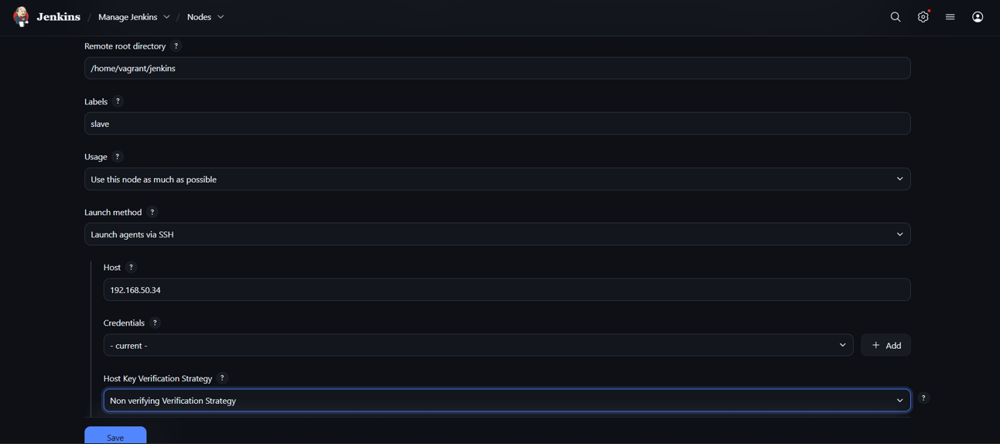

 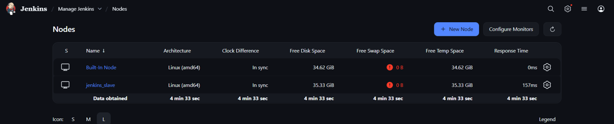

 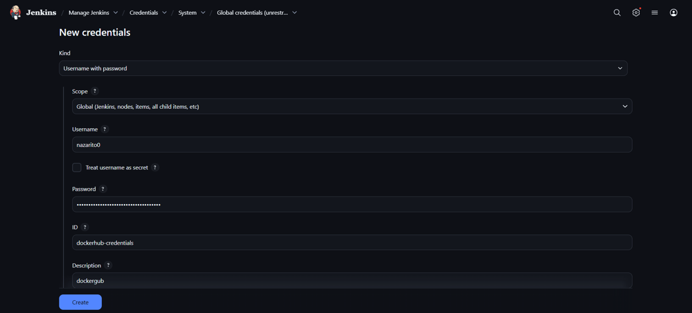

 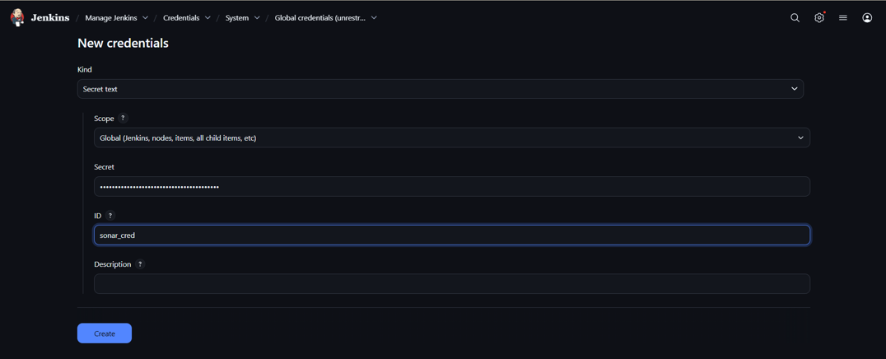

 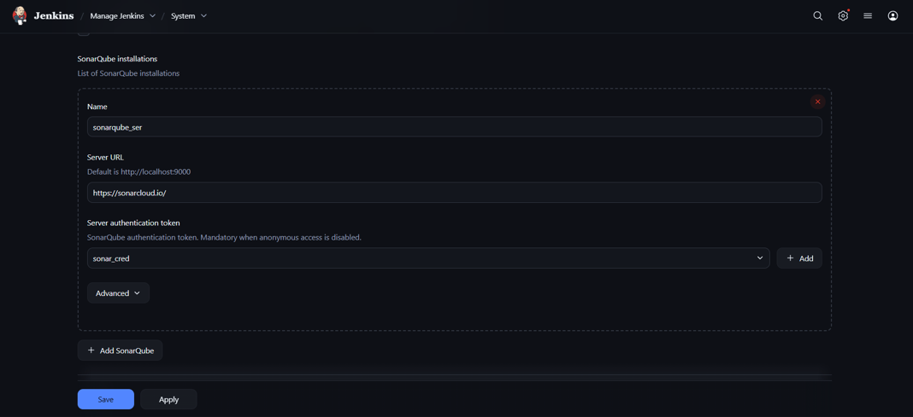

 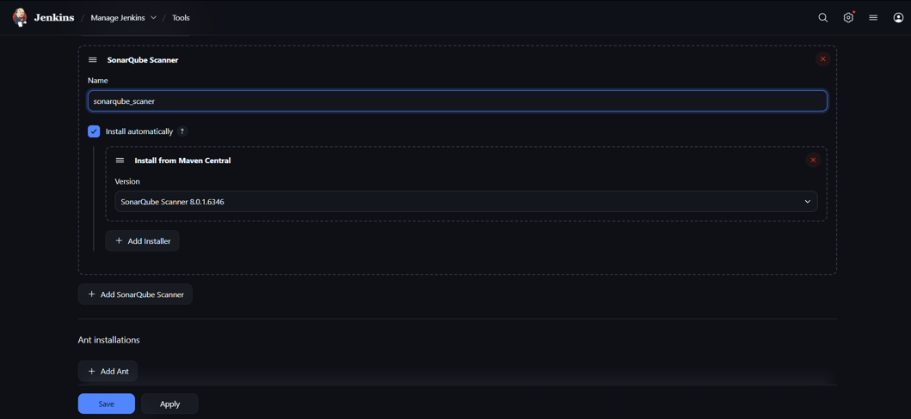

 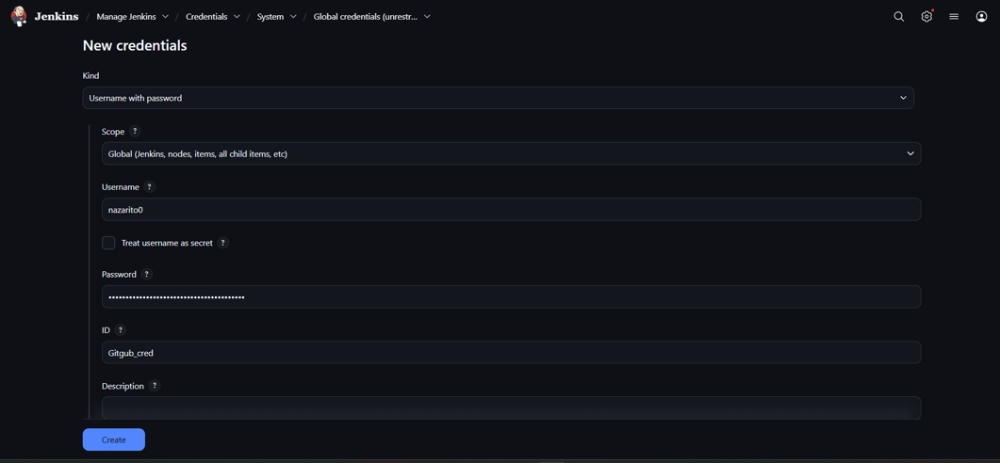

 - Створіть пайплайн:

 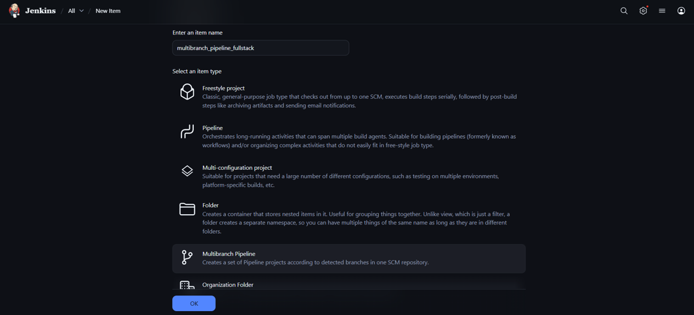

 

 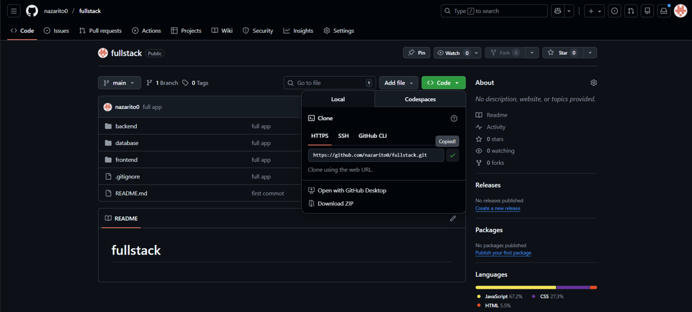

 

 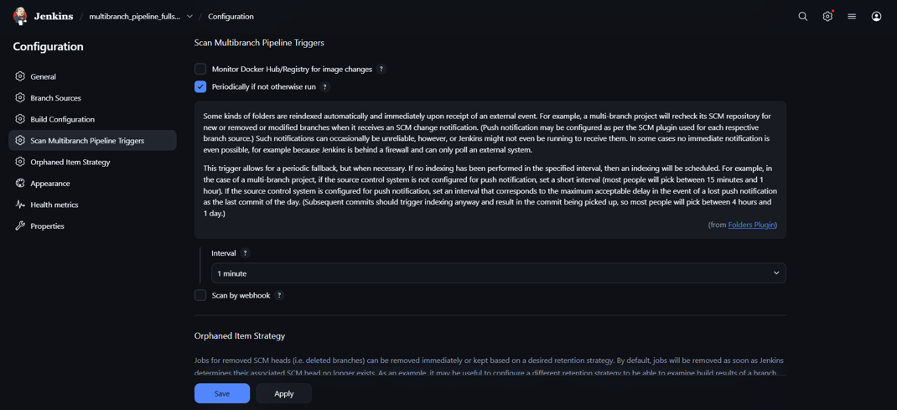

 - Чотири креденціала має бути додано.

 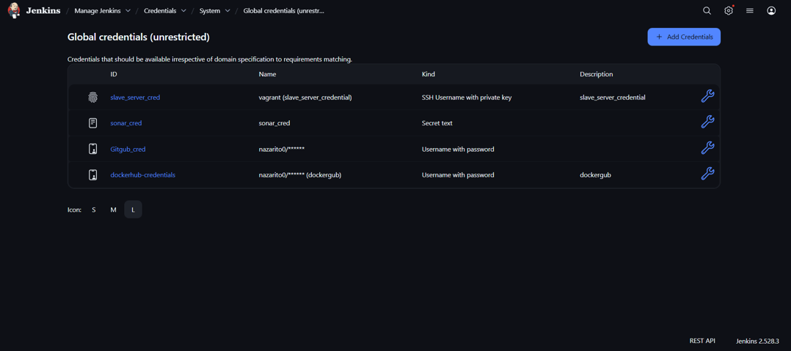

 ---

 - **Налаштування slave vm**

 - Налаштуйте haproxy.cfg:

 `cd /etc/haproxy/haproxy.cfg`

 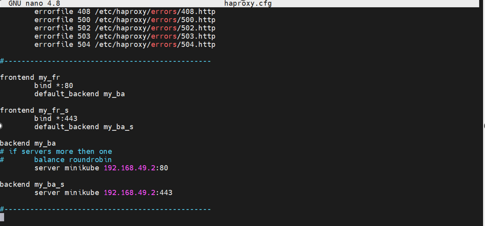

 - Запустіть minikube:

 `minikube start --nodes 3 -p prod`

 - Підключіть через addon IngressControler:

 `minikube addons enable ingress`

 - Встановіть ArgoCD у кластер:

 `kubectl create namespace argocd`

 `kubectl apply -n argocd -f https://raw.githubusercontent.com/argoproj/argo-cd/stable/manifests/install.yaml`

  - Запустіть файл ingress.yaml який у папці argocd на slave щоб перенаправити ArgoCD через IngressControler.

 `kubectl apply -f ingress.yaml`

 - Витягніть пароль до ArgoCD

 `kubectl -n argocd get secret argocd-initial-admin-secret -o jsonpath="{.data.password}" | base64 -d; echo`

 - Створіть репозиторій на GitHub для ArgoCD і закиньте тупи папку HelmCharts і підключіть по SSH. Згенеруйте ключі командою:

 `ssh-keygen`

 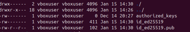

 - Добавити у репозиторій deploy key, public:

 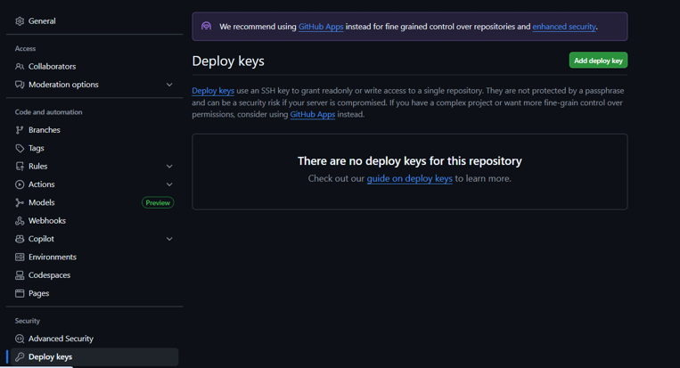

 - Добавити у ArgoCD репозиторій GitHub, і SSH private key:

 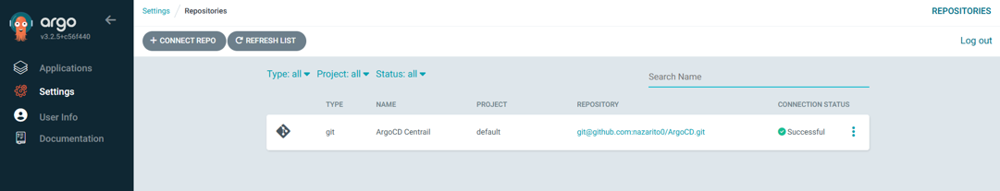

 - Також силка на GitHub репозиторій додатка:

 `https://github.com/nazarito0/fullstack`

**6. Майбутні покращення**

 - Cloud Migration: Перенесення проєкту на AWS за допомогою Terraform.

 - Secret Management: Впровадження HashiCorp Vault (замість базових K8s Secrets) для динамічного керування паролями.